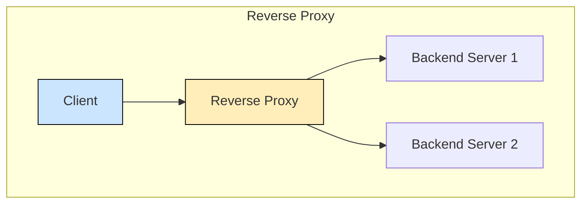
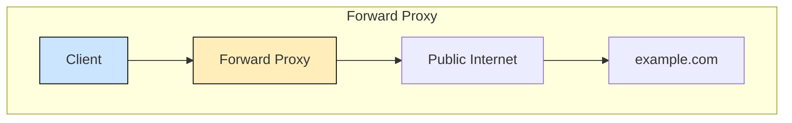

+++
title = "Traffic routing"
type = ""
weight = 6
+++
 
 # Reverse Proxy

This is server that is used as the entrypoint to your machine, using then the request **Host** and **Path** requested (layer 7) to route traffic to the appropriate machine. 
Let's imagine you have multiple servers running in your LAN. You would expose your reverse proxy to the internet, that proxy would receive all request and the route then accordingly. For example `kalschatzi.com` routes to one internal IP and port, and `learn.kalschtzi.com` to another different pair of IP and port.

## Forward proxy
This does the inverse where it hides the **client** rather than the server. The way that it works is that when entering a URL on a browser like `kalschatzi.com` it first connects to the configured proxy server and only then to the actual `kalschatzi.com` server, which can itself be exposed with a reverse proxy. This is a **client** side configuration and will not affect in any way the server

### Why use one?
There can be a number of benefits, depending on need.
* **Caching**: proxies can cache GET requests and this speeds up responses and saves bandwidth
* **Content Filtering / Control**: It allows content being request to be filtered and blocked if necessary.
* **Privacy**: It can hide your real IP address.
* **Security**: It can enforce security policies like only allow HTTPS sites

## Load Balancers

Load balancers are similar to reverse proxies with a bigger focus on traffic shapping. Their main goal is ensure high availability and load distribution.
It can handle things like if your application has multiple replicas/servers it will distribute the load across all of them, and if one of them is down or unresponsive, it will stop sending request to that one and only use the other ones.

Some reverse proxies can also work as load balancers, like [NGINX](https://nginx.org/en/) (reads engine X).

There are different kinds of load balancer, while the first 2 on the list are the most commonly used on day-to-day

### Layer 4 Load Balancer

Works at the TCP/UDP level. 
Makes decisions based on:
* IP address
* Port number
* Protocol (TCP/UDP)

It's good for raw traffic routing, but if you want it to handle things like routing based on request URL (host header) that is a layer 7 feature and is not supported.

### Layer 7 Load Balancer

Works at the HTTP/HTTPS level
Makes decisions based on:

* URL path (/api, /images)
* Host header (learn.kalschatzi.com)
* Cookies, user-agent, other headers.

This has the benefit of being able to do what layer 4 LB can do, modify requests like adding headers (`x-forwarded-from` for example) and do smarter routing based on Layer 7 properties.
The downside is that it's heavier and slower that a TCP/UDP LB.

### Global Load Balancer (DNS/Geo-Based)
Routes users to the closest datacenter
Based on:
* Geography (GeoDNS)
* Latency
* Health of regions

This is great for global performance as you can distribute your workload across the globe to whether it's fastest for the specific user. Which is why when you go to something like `netflix.com` even though it's the same URL, you'll be hitting different servers depending on where the request is coming from. This then will also allow for **failover** scenarios.

### Hardware Load Balancer (Physical devices)

Dedicated appliances
* Combines L4 and L7 features
* Often used in enterprise data centers

It seems great in paper but it's very expensive, and being a physical device, it's not very cloud friendly.

### There are the different ways to distribute load
* Round Robin -> distribute evenly, not caring how busy each is
* Least Connections -> Send to the server with the fewest open connections"
* IP Hash -> Stick a client to a specific server. Used for sticky session scenarios in an alternative to cookies
* Weighted Round Robin -> Take turns, but favor stronger servers. If **A** has weight of 4 and **B** has 1, it will send 4 times as many requests to **A** than **B**.
* Health-based routing -> Only send to healthy servers. This is combined with other algorithms. It will send every few seconds a ping HTTP request to each server and if they fail, it will stop routing request to that server, allowing it to process already accepted requests without overloading it more.
